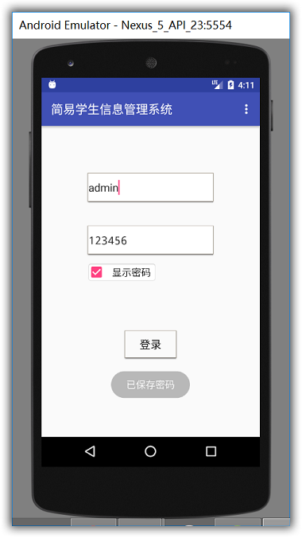

### 说明
大三上这学期任选课报名了《Android移动应用开发》，这个程序则是该课程的结课作业。
  个人博客地址：https://lthergo.com
### 登陆界面
程序很小，一个登陆界面，内置了两个账号，student和admin，密码均为123456。登陆成功分别跳转不同的activity，登陆界面做了个记住密码和点击显示密码，用了sharedpreference存储在本地(不安全)，打开DDMS找到		   `data/data/com.lthergo.studentsystem/shared_prefs/config.xml`将文件导出后打开，可以看到存储在文件中的用户名和密码
		
### 主界面
管理员登陆成功后界面如下
    
使用了Android自带的SQLite存储，定义了StudentDBOpenHelper的抽象类实现数据库被创建调用的方法，StudentInfo作为学生信息存储的实体类，StudentDao来实现学生数据的增加，删除（和查找），同样打开DDMS，找到
`data/data/com.lthergo.studentsystem/databases/student.db`将文件导出并打开
	
我们可以看到，学生信息已经存储在本地数据库中了。界面通过ListView展示每一个学生信息的item，学生端登陆成功后只能进行查看操作，没有添加删除等权限。
### 调试相关
此程序用Android Studio2.2.3开发，如果导入项目一直卡在building gradle，请将项目目录下build.gradle和app/build.gradle文件里的相关信息修改为你电脑里的Android Studio信息。程序里学生信息和联系方式用的是string型，可以输入为任意字符串，学生ID为long型，不能超过2^63-1（19位数），否则会出现异常闪退。删除操作是根据学生ID的数字信息去数据库中查找而实现的
```
public boolean delete(String Studentid) {
        SQLiteDatabase db = helper.getWritableDatabase();
        int count = db.delete("info", "studentid=?", new String[]{Studentid});
        db.close();
        return count <= 0 ? false : true;
    }
```
因此如果同一个ID下有多条信息，点击删除则会删除该ID下的所有信息。